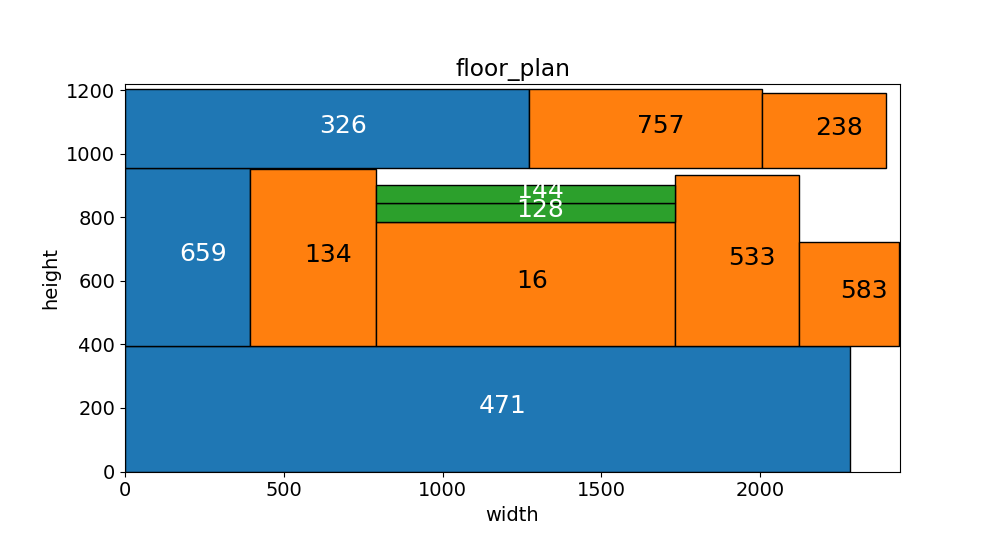
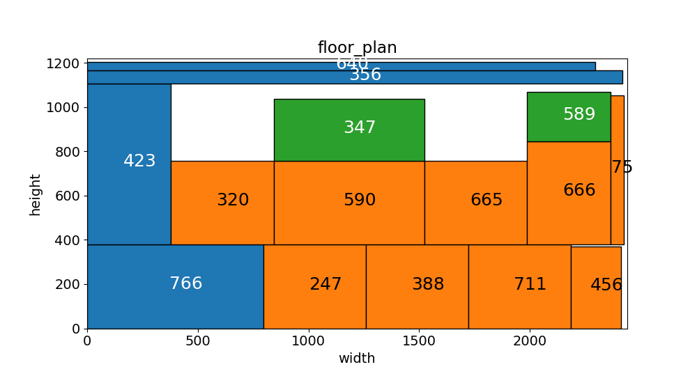
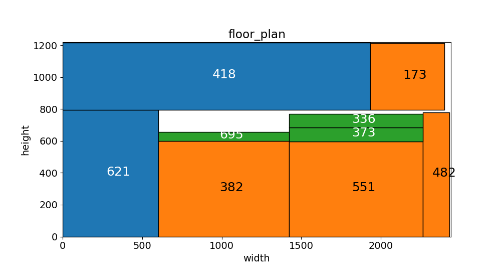
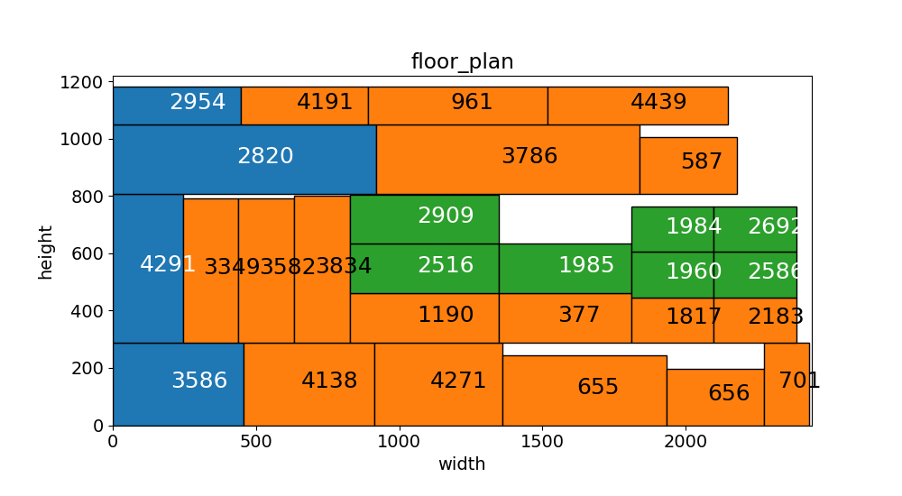

### GMCM-2022-B
Our solution to National Post-Graduate Mathematical Contest in Modeling in 2022 of Problem B

### Methods

Q1：3H切割方式或者3E切割方式 + Item按面积、长边或者短边排序 + 填充按面积、长边或者短边排序。 

Q2：Item总数量和总面积约束的DBSCAN算法进行组批，组批完采用Q1的方法进行排样。

### Usage

Just run the main.py to obtain the results, or modify the config settings in main.py and run.

```
python main.py
```

### Results

#### Question 1:

表 1 A组数据排样结果表

|  数据  | 消耗板材数 | 板材利用率 |
| :----: | :--------: | :--------: |
| dataA1 |     88     |   0.949    |
| dataA2 |     86     |   0.963    |
| dataA3 |     87     |   0.962    |
| dataA4 |     86     |   0.952    |

A1:

less_bins: 88

best_efficiency: 0.949084892868486

best_sets: best_longside-rotated-sorting-SplitSameAsPreviousAxis-DESCSS-0

 

A2:

less_bins: 86

best_efficiency: 0.9634703138378655

best_sets: best_longside-rotated-sorting-SplitSameAsPreviousAxis-DESCSS-0

 

A3：

less_bins: 87

best_efficiency: 0.9622196866495535

best_sets: best_area-rotated-sorting-SplitSameAsPreviousAxis-DESCSS-0

 

A4:

less_bins: 86

best_efficiency: 0.9515846616938433

best_sets: best_shortside-rotated-sorting-SplitSameAsPreviousAxis-DESCSS-0


#### Question 2:

表 2 组批及排样结果表

|  数据  | 批次数 | 消耗板材数 | 板材利用率 |
| :----: | :----: | :--------: | :--------: |
| dataB1 |   57   |    3777    |   0.788    |
| dataB2 |   44   |    2506    |   0.769    |
| dataB3 |   49   |    2502    |   0.772    |
| dataB4 |   43   |    2549    |   0.796    |
| dataB5 |   74   |    4030    |   0.767    |

B1:

less_bins: 3777

best_efficiency: 0.7883577515382038

best_sets: best_long_side-rotated-sorting-SplitSameAsPreviousAxis-DESCSS-0

 

B2:

less_bins: 2506

best_efficiency: 0.7687222884909595

best_sets: best_long_side-rotated-sorting-SplitSameAsPreviousAxis-DESCSS-0

 

B3:

less_bins: 2502

best_efficiency: 0.772718752436911

best_sets: best_long_side-rotated-sorting-SplitSameAsPreviousAxis-DESCSS-0

 

B4:

less_bins: 2549

best_efficiency: 0.7962636535144704

best_sets: best_area-rotated-sorting-SplitSameAsPreviousAxis-DESCSS-0

 

B5:

less_bins: 4030

best_efficiency: 0.7665058966345528

best_sets: best_long_side-rotated-sorting-SplitSameAsPreviousAxis-DESCSS-0


### Visualization

Examples of visualization results.









@Programming：Minhao Zou

@Modeling and Writing：Yutong Wang、Xiaotong Zhong